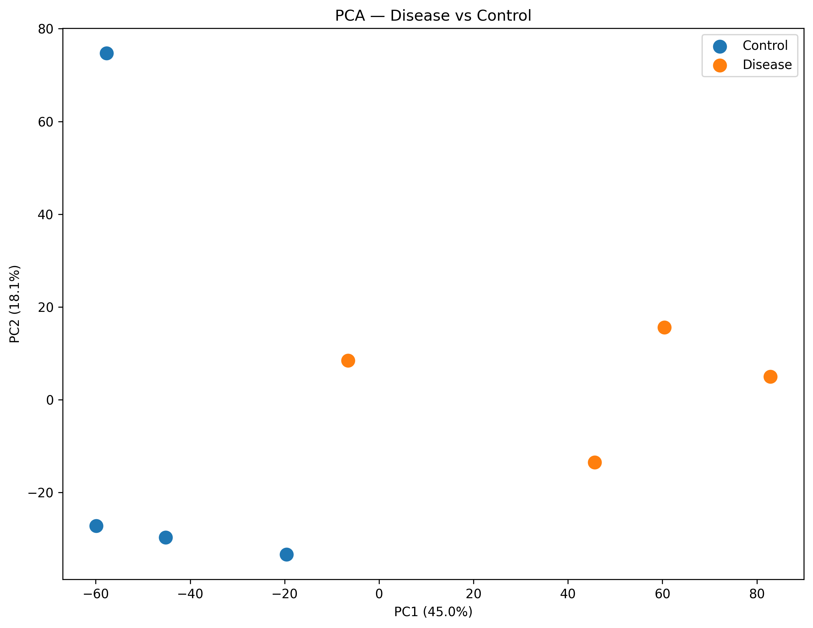
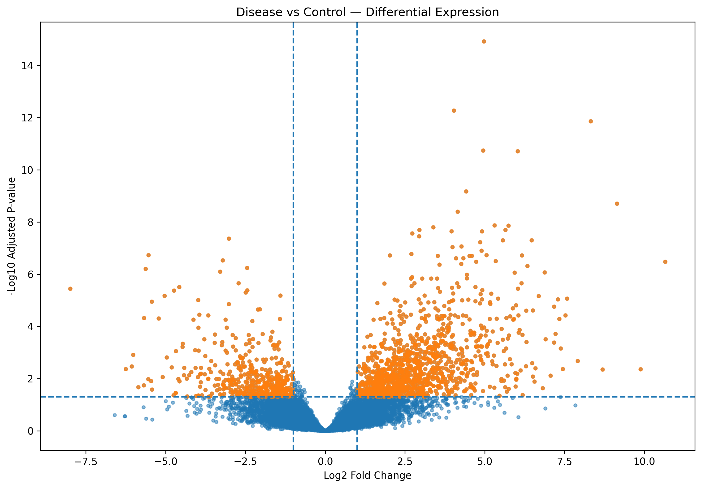
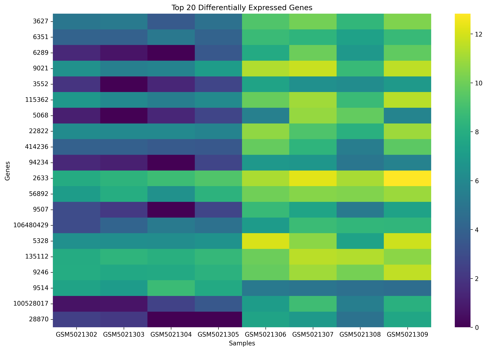
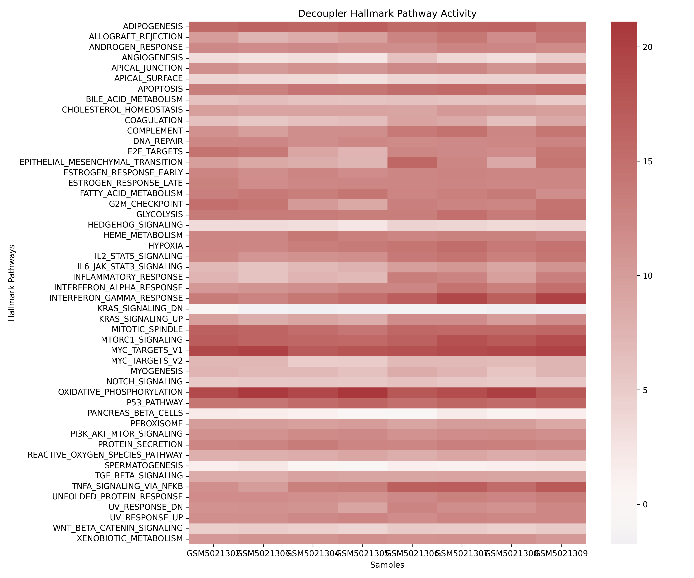

# Disease Biomarkers from RNA-seq

## Overview

This project identifies candidate disease biomarkers from RNA-seq expression data using differential expression analysis and pathway activity inference.

The analysis uses the GEO dataset **GSE164871**, comparing Crohn's disease samples with control samples.

## Biological Question

Which genes and biological pathways show differences between Crohn's disease and control samples, and which genes could be prioritized as candidate biomarkers?

## Dataset

- **Dataset:** GEO GSE164871
- **Disease:** Crohn's disease
- **Samples:** 8 total
- **Control:** 4 samples
- **Disease:** 4 samples
- **Data type:** RNA-seq gene expression
- **Source:** NCBI Gene Expression Omnibus (GEO)

## Workflow

1. Load and inspect the expression matrix and sample metadata.
2. Perform sample-level quality exploration and PCA.
3. Perform differential expression analysis using DESeq2.
4. Identify significantly differentially expressed genes.
5. Generate volcano plots and top-gene heatmaps.
6. Map gene identifiers to gene symbols.
7. Infer Hallmark pathway activity using decoupler.
8. Prioritize candidate biomarkers using effect size and statistical significance.
9. Compare candidate genes with published literature.

## Key Results

### Differential Expression

Genes were considered significant using:

- Adjusted p-value < 0.05
- Absolute log2 fold change > 1

This resulted in **1,672 significant genes**.

### Candidate Biomarkers

Top candidates included:

- SAA2
- REG3A
- CXCL10
- CXCL5
- IL1A
- SOCS3
- CCL4
- SAA2-SAA4
- FOXQ1
- LOC105372337

REG3A, CXCL10 and CXCL5 showed supporting evidence in the literature and were therefore notable candidates for further investigation.

### Pathway Activity

Decoupler analysis using Hallmark pathways showed increased inferred activity in several inflammatory pathways, including:

- Inflammatory Response
- TNFα Signaling via NF-κB
- Allograft Rejection
- Epithelial-Mesenchymal Transition
- Interferon Gamma Response
- IL6-JAK-STAT3 Signaling

## Figures

### PCA


### Volcano Plot


### Top Gene Heatmap


### Decoupler Pathway Activity


## Repository Structure

```text
Disease_Biomarkers_RNAseq_GSE164871/
│
├── notebooks/
│   ├── 01_DESeq2_analysis.ipynb
│   ├── 02_Decoupler_analysis.ipynb
│   └── README.md
│
├── data/
│   ├── GSE164871_metadata.csv
│   └── README.md
│
├── results/
│   ├── differential_expression.csv
│   ├── significant_genes.csv
│   ├── candidate_biomarkers.csv
│   ├── pathway_activity_results.csv
│   └── literature_summary.csv
│
├── figures/
│   ├── PCA.png
│   ├── volcano_plot.png
│   ├── top_genes_heatmap.png
│   ├── decoupler_activity.png
│   └── README.md
│
└── README.md
##Tools
- Python
- R
- DESeq2
- decoupler
- pandas
- NumPy
- matplotlib
- seaborn
- MyGene
##Limitations
This analysis contains only 8 samples, with 4 disease and 4 control samples. Therefore, the identified genes should be considered candidate biomarkers, not clinically validated biomarkers.
Pathway activities inferred by decoupler represent computationally inferred biological activity and do not constitute experimental validation.
Further validation using larger independent cohorts and experimental studies would be required.
##Reproducibility
The complete analysis workflow is provided in the Jupyter notebooks under notebooks/.
The original dataset is available from GEO using accession GSE164871.
##Conclusion
This project demonstrates an end-to-end RNA-seq biomarker discovery workflow combining differential expression analysis, pathway activity inference and literature-supported candidate prioritization.
